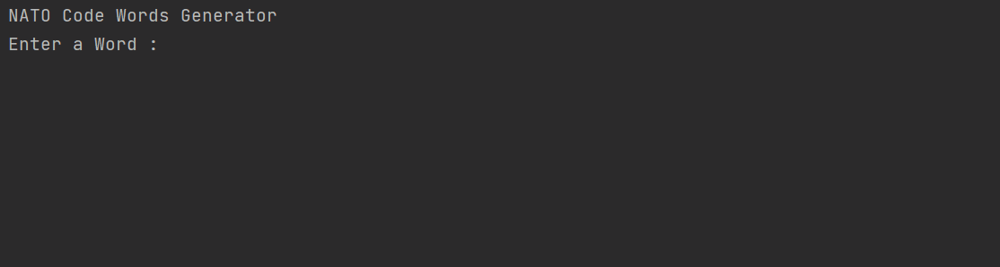

# NATO Alphabet Generator

**Level -** Easy | Beginner

**Modules Used -** Pandas, list and dictionary comprehensions

**Description -** Takes a word as user input and prints array of code words used by NATO if they want to communicate over weak communication channels. 

**Compilation -** python main.py

