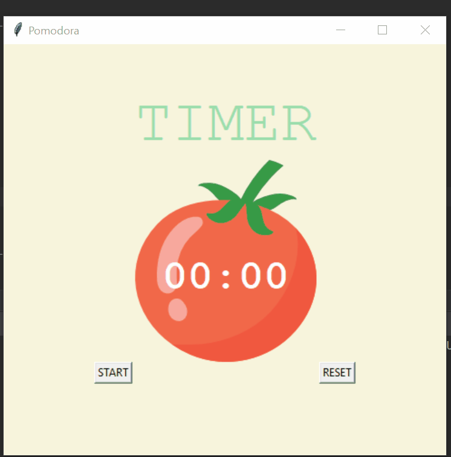

# Pomodora

**Level -** Medium | Beginner

**Modules Used -** Tkinter

**Description -** A GUI Application for Pomodoro Technique. The **Pomodoro Technique** is a time management **method** developed by Francesco Cirillo in the late 1980s. The **technique** uses a timer to break down work into intervals, traditionally 25 minutes in length, separated by short breaks.

**Compilation -** python main.py

