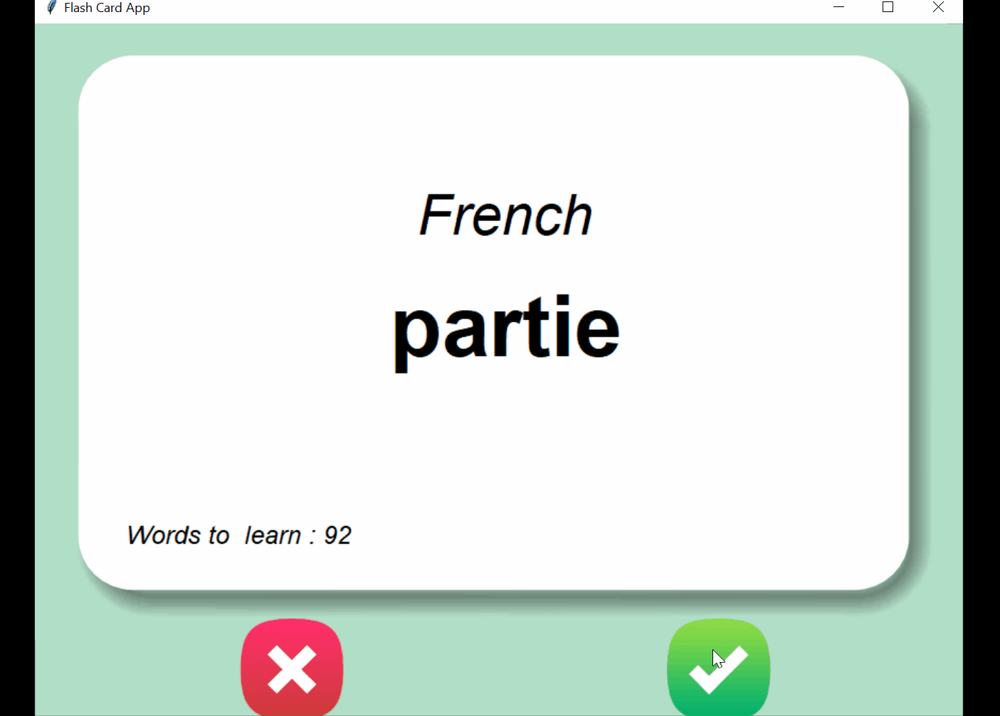

# Flash Card App

**Level -** Medium | Intermediate

**Modules Used -** Tkinter, Pandas

**Description -** A Flash Card Application which reads 100 words from csv file which are frequent French words collected from movie subtitles. After 3 seconds of showing French word, English translation is showed. Clicking on green will not show this word again. 

**Compilation -** python main.py

